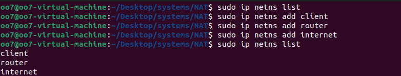
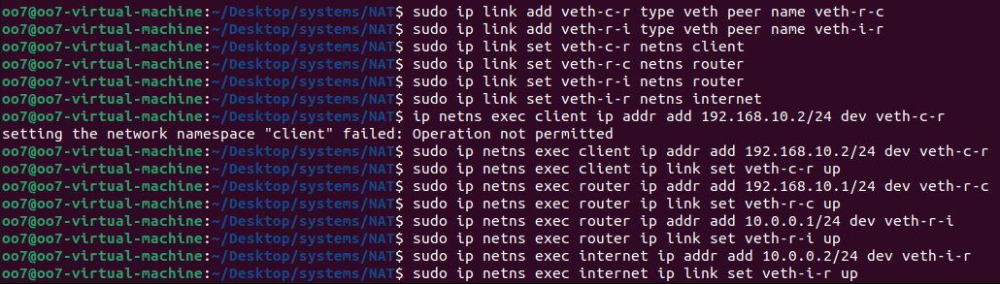
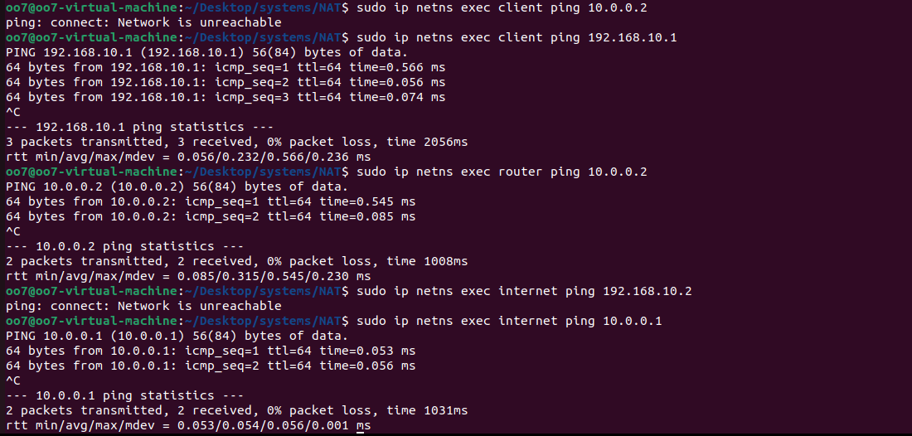
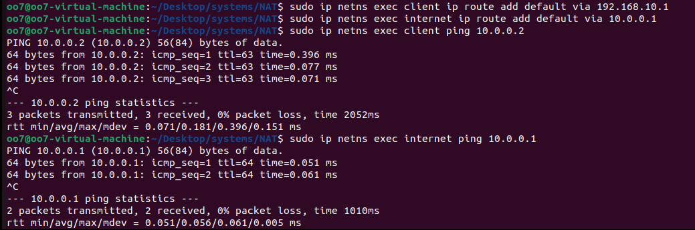
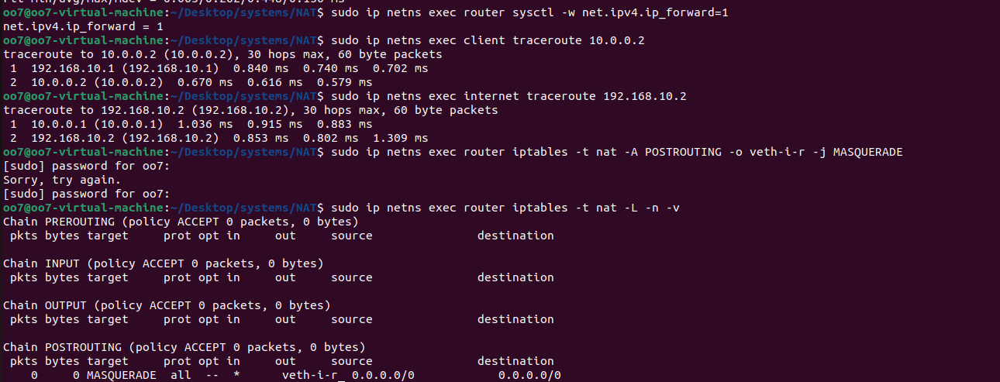
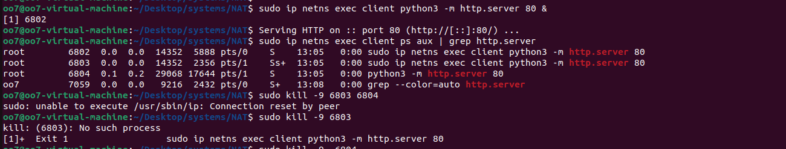
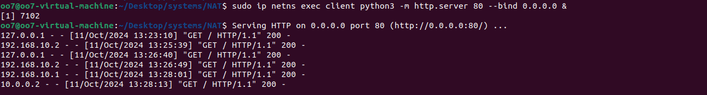
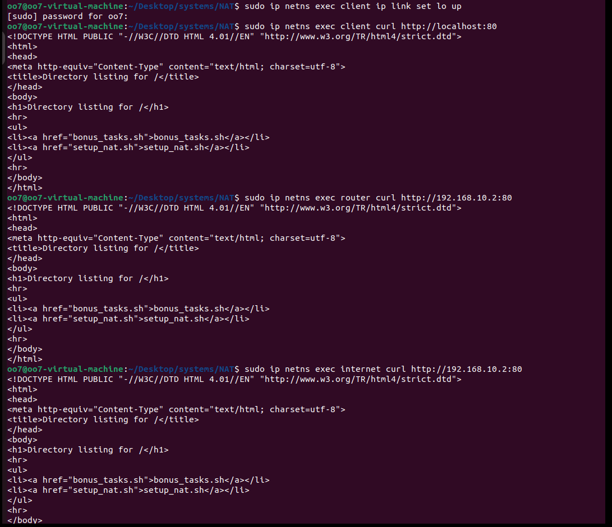
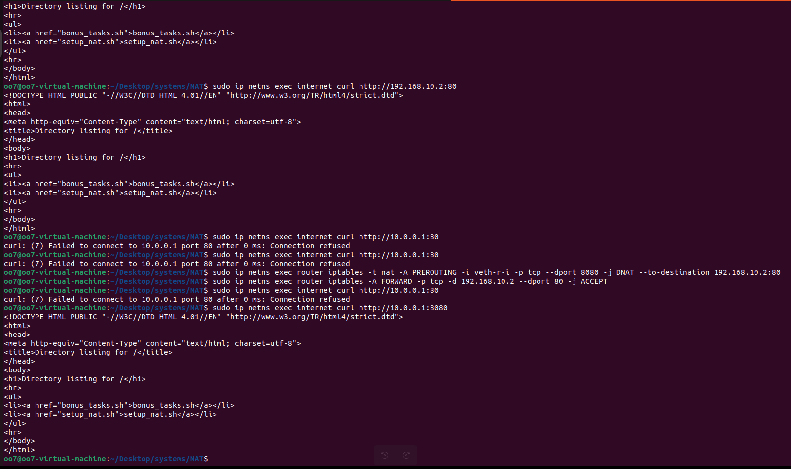
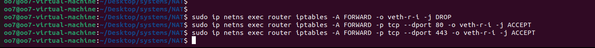

 defining the namespaces client ,router ,internet(to simulate the internet)

Defining the virtual connections and adding ip addresses to the namespaces and creating the topology for the lan and assigning the 10.0.0.0/24 to represent the public ip address and 10.0.0.1 is assigned to the router.after assigning the links and ip address ,activating the links

if we now try to ping the internet from the client we cant connect as even there is clear path to the internet from the client through router namespace ,The routing table of the client has only the entry of the path to the router form the client to it drops the packet.hence client can ping the router and internet can ping the router but client cant ping the internet

To enable the connection we can define default paths which make the namespace to send the packets for which the route is not specified in the routing table so now we can ping internet form the client.But actually if we do this using actual public ip address for the router we cannot directly reach the internet as a router drops all private network packets 

Hence we use ip forwarding and ip masqurade which masks all the private network packets to the internet such that they become that the packets came from the router it self as they have the routers public ip address as their ip address

for doing the bonus task i started a sever using a python command on port 80 in client .I tired to ping the server to check its reachablily among different namespaces but the sever was unreachable for all namespaces then i tried to bind the server to a ipv4 thinking that it is working on ipv6 then i understood that the the lo loopback network was down then i tried to up the loopback network. 

The server was able to connect to any namespace upon using the ip address and the port .The problem was that it doent work for the real world as the outside world dosnt know the private ip address of the the individual namespace so we need to use port forwarding so when a person from the internet  want to access the webserver he uses the public ip address of the router and the port used for the port forwarding to access the router.The port forwarding ensures that the all request to the router port (here 8080) reach the webserver in its own mapped port (port 80)

For restricting the outbount traffic in the client (LAN)  to https(443) and http(80) we can use the iptable forward command so that the inside The (LAN) there is only https and http protocol .
